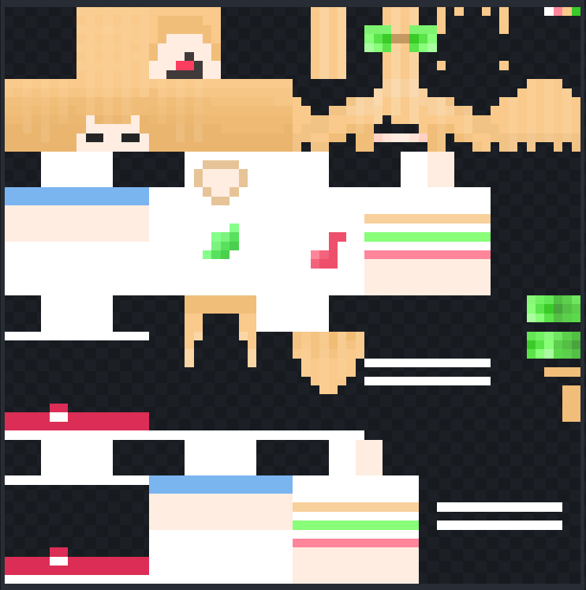
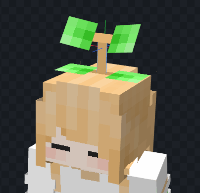
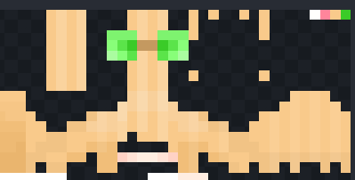
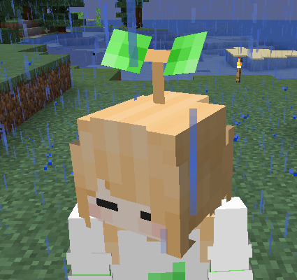
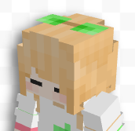

# KaCosmetics
一個神奇的長草模組。
> 只要玩家的 skin 符合指定條件，就可以在頭上長出一枝草！

---
## 安裝

請使用 1.20 以上的版本。更舊的版本將不能使用這個模組。\
目前測試過支援的版本如下：

| 版本           | Fabric | Quilt | Forge |
|--------------|--------|-------|-------|
| `1.20`（基底版本） | ✅      | ❓     | ❓     |
| `1.20.1`      | ✅      | ❓     | ❓     |

> 目前已知本模組會和 OptiFine 衝突！\
> 如果您有在使用 OptiFine 的話，安裝這個模組會導致模組載入失敗，Minecraft 會崩潰！

### Fabric
這個模組需要您安裝 [Fabric API](https://www.curseforge.com/minecraft/mc-mods/fabric-api) 才能運作！\
將這個模組和 Fabric API 放到 `mods` 資料夾就可以了！

### Quilt
這個模組需要您安裝 [Quilted Fabric API](https://www.curseforge.com/minecraft/mc-mods/qsl) 才能運作！\
將這個模組和 Quilted Fabric API 放到 `mods` 資料夾就可以了！

### Forge
將這個模組放到 `mods` 資料夾就可以了！

---

## 關於 Skin 規範
為了不影響其他沒有特別為這個模組設計的 skin，
以及讓其他沒有使用這個模組的玩家不至於看到詭異的外觀，
所以設計了 skin 規範。\
若玩家的 skin 不符合這個規範，則該玩家的頭上將不會長草。

以下舉例一個符合規範的 skin 做為參考：

---

若要符合這個規範，玩家的 skin 至少務必要遵守以下一點：

* Skin 最右上角的像素，由左至右必須填上這三個顏色：
    - 紅色：`#ff859b`
    - 黃色：`#f9ca8b`
    - 綠色：`#3acb28`
    - 以上的顏色，**不透明度只能是 100%**

> 若沒有達成這個前提，就完全不會長草喔！

### 材質對應
首先我們先說明等等會用到的「UV 表示法」，以表達每個區塊的絕對位置和大小。\
格式會是 `x=..., y=..., w=..., h=...`，其中：
* `x` 代表橫向的位置，以像素為單位，**0 代表最左邊的那一格** (這很重要)
* `y` 代表縱向的位置，以像素為單位，**0 代表最上邊的那一格** (這很重要)
* `w` 代表幾個像素寬，`h` 代表幾個像素高。

再來我們會說明每個用到的區塊，並賦予它們各一個代號：

* A
    - 這個區塊的上邊緣與手臂和身體的下邊緣對齊，靠在整個材質的最右邊
    - UV 表示法：`x=58, y=32, w=6, h=3`
    - **對應到頭上的草的左側葉子**
* B
    - 在 A 區塊的正下方，**兩個區塊中間有一個像素的間隔**
    - UV 表示法：`x=58, y=36, w=6, h=3`
    - **對應到頭上的草的右側葉子**
* C
    - 在 B 區塊的下方，靠在整個材質的最右邊，**兩個區塊中間有一個像素的間隔**
    - UV 表示法：`x=60, y=40, w=4, h=1`
    - **對應到兩片葉子的連接處**
* D
    - 在 C 區塊的下方，靠在整個材質的最右邊，**兩個區塊中間有一個像素的間隔**
    - UV 表示法：`x=62, y=42, w=2, h=4`
    - **對應到以上部件和頭顱的連接處（也就是植物的莖）**
---

接下來請檢查是否有以下情形：
* Skin 頭部有其他裝飾物件等，與長出的草有衝突
    - 特別是那些頭部已經有畫出草的 skin，如附圖：\
      
* 或是您想要在頭頂的部分做出區別
    - 像是有裝這個模組的玩家和原版玩家，您可能想讓這兩類的玩家看到不同的頂部
    - 一種情況是您想搭配這個模組更改您的 skin，但是想對沒有裝模組的玩家保持原本的 skin

如果沒有這些情形的話，您只需要把以上 A~D 的區塊畫好就可以了！\
但是如果您符合以上情形的話，請繼續看下去！

---

### 針對特殊情形的材質需求

這邊假設您的頭頂需要針對原版和長草模組使用不同材質。\
在此情況下，請先確認您需要特別處理的部位。\
您可以選擇**頭部的內層或外層的頂部**進行處理（或是兩者一起處理）。

您的 skin 必須要有額外的標示，才能處理以上這些額外情形：

* Skin 最右上角，從右邊數過來第四個像素（以下稱為模式標記），必須填上指定顏色：

  | 顏色        | 作用                    |
  |-----------|-----------------------| 
  | `#fffffe` | 處理頭部外層頂部的材質           |
  | `#fffeff` | 處理頭部內層頂部的材質           |
  | `#fffefe` | 處理頭部外層與內層，**兩者**的頂部材質 |

  - 以上的顏色，**不透明度只能是 100%**
    
> 若沒有正確的模式標記，就不會對頭頂做任何額外處理！

以上特殊情形會需要定義下面額外的區塊：

* E
    - 位置在玩家 skin 帽子（外層）的部分，在可見範圍的左上側
    - UV 表示法：`x=32, y=0, w=8, h=8`
    - **這裡的區塊會取代原本的外層頂部**
* F
    - 位置在玩家 skin 頭（內層）的部分，在可見範圍的左上側
    - UV 表示法：`x=0, y=0, w=8, h=8`
    - **這裡的區塊會取代原本的內層頂部**

請依照您的需求調整模式標記，在您需要調整的區塊（E、F）完整畫上新的頂部材質即可！
> 若您已經指定模式標記，則頭部頂部會依照模式以對應的區塊（E、F）取代！

---

### 範例

如本範例，這邊選用 `#fffffe` 的模式，處理頭部外層頂部的材質。\
對於有裝模組的玩家，會看到以下的材質：

對於沒有裝模組的玩家（或是 skin 預覽網站），會看到以下材質：

